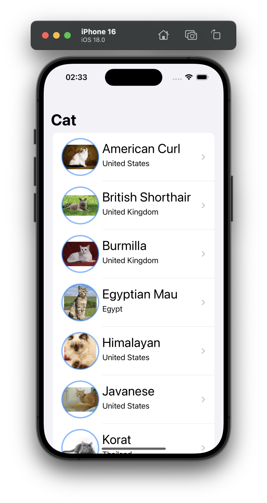
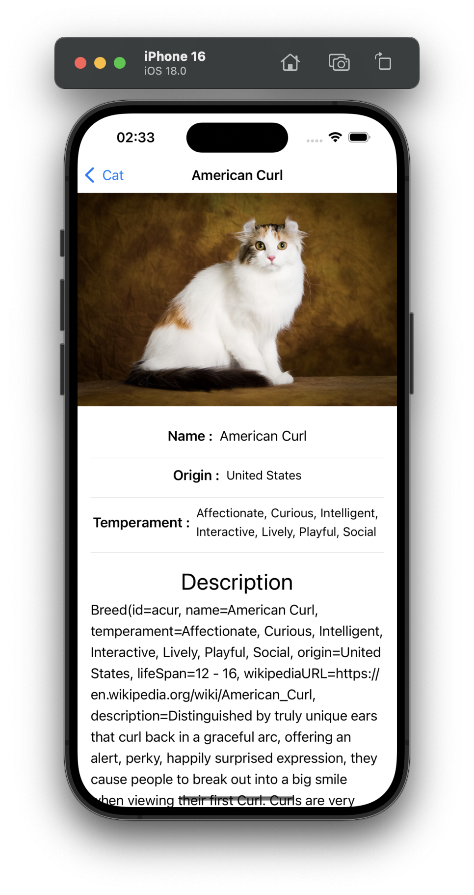

# TheCatApi-Paging.KMP

A Kotlin Multiplatform project demonstrating how to fetch and display cat images from TheCatAPI with pagination support. This project targets multiple platforms, including Android, iOS, and desktop, using Kotlin Multiplatform Mobile (KMM).

## Features

- **Kotlin Multiplatform (KMM)**: Shared business logic for Android, iOS, and desktop.
- **Pagination Support**: Load cat images with infinite scrolling.
- **TheCatAPI Integration**: Fetch cat images and breed details from TheCatAPI.
- **Coroutines**: Asynchronous programming for data fetching.
- **Flow**: Handle data streams across different platforms.
- **Ktor**: Networking library for making API requests.
- **Serialization**: Convert JSON to Kotlin objects with Kotlinx Serialization.
- **Multiplatform UI Support**: Shared logic across platforms with platform-specific UI.

## Technology Used

- **Kotlin Multiplatform**: Share code across platforms.
- **Ktor**: HTTP client for API communication.
- **Kotlinx Serialization**: JSON parsing.
- **Coroutines & Flow**: Asynchronous programming and state handling.
- **Jetpack Compose**: For Android UI.
- **SwiftUI**: For iOS UI.

## Screenshots

| iOS List Screen                          | iOS Detail Screen                             |
|------------------------------------------|-----------------------------------------------|
|  |  |

## App Architecture

This project demonstrates the power of Kotlin Multiplatform by sharing business logic and data layers across Android and iOS. The architecture consists of three main layers:

1. **Domain Layer**: Contains business logic and use cases.
2. **Data Layer**: Handles data fetching from TheCatAPI using Ktor.
3. **Presentation Layer**: Contains platform-specific UI code (Jetpack Compose for Android and SwiftUI for iOS).

## How It Works

1. The app requests a list of cat images from TheCatAPI, handling pagination.
2. The data is fetching from TheCatAPI using Ktor.
3. The UI observes data changes via Kotlin Flow, updating the list as new pages load.

## Contributing

Contributions are welcome! Please fork the repository and create a pull request with detailed explanations of your changes.

## License

This project is licensed under the MIT License. See the [LICENSE](./LICENSE) file for details.